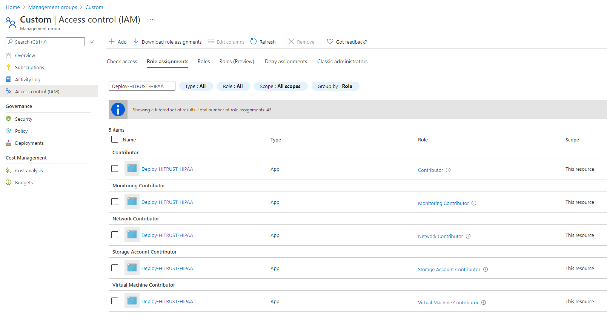
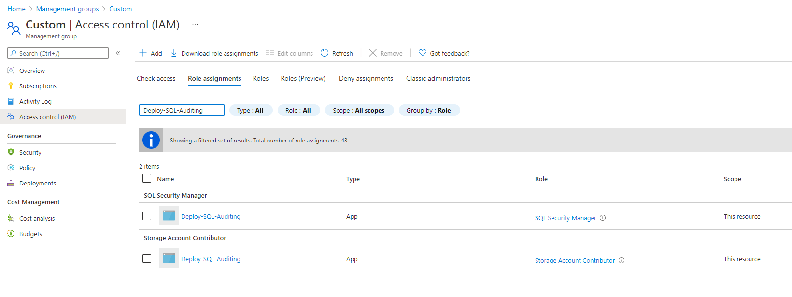
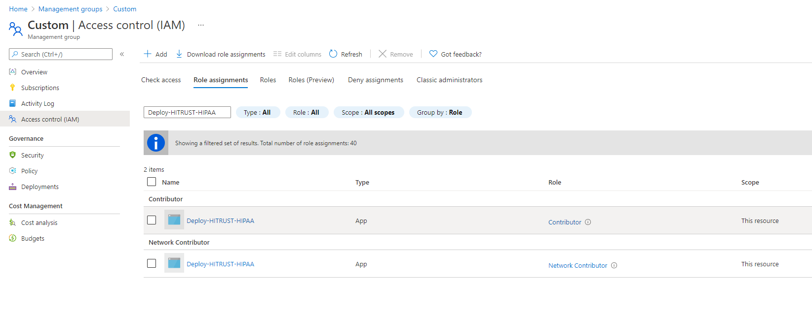
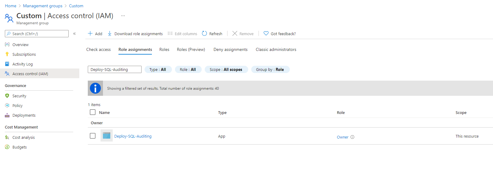

<!-- markdownlint-disable first-line-h1 -->
## Overview

This page describes how to deploy your Azure landing zone with a custom configuration, including guidance on how to override the dynamically generated Role Assignments for a specific Policy Assignment with Managed Identity.

> **NOTE:** This feature is available from version 0.2.2.

We will use the `Deploy-HITRUST-HIPAA` and `Deploy-SQL-Auditing` policy assignments as an example.

On deployment, the module will auto-generate the role assignments necessary for any Policy Assignment when a Managed Identity is required to support policies using `Modify` or `DeployIfNotExists` effects.

- For `Deploy-HITRUST-HIPAA` the module will generate 5 role assignments:
  

- For `Deploy-SQL-Auditing`the module will generate 2 role assignments:
  

We will update the built-in configuration following these steps:

- Create the policy assignment definitions `Deploy-HITRUST-HIPAA` and `Deploy-SQL-Auditing`

- Create the custom archetype definition `customer_online`

- Override the dynamically generated Role Assignments for `Deploy-HITRUST-HIPAA` and `Deploy-SQL-Auditing` Policy Assignments in a custom Landing Zone Management Group.

- Enable the role assignment override with `custom_policy_roles`

> IMPORTANT: Ensure the module version is set to the latest, and don't forget to run `terraform init` if upgrading to a later version of the module..


## Example root module

To make the code easier to maintain when extending your configuration, we recommend splitting the root module into multiple files. For the purpose of this example, we use the following:

- [terraform.tf](#terraformtf)
- [variables.tf](#variablestf)
- [main.tf](#maintf)
- [lib/policy_assignments/policy_assignment_dhh_policy_set_definition.json](#libpolicy_assignmentspolicy_assignment_dhh_policy_set_definitionjson)
- [lib/policy_assignments/policy_assignment_dsa_policy_set_definition.json](#libpolicy_assignmentspolicy_assignment_dsa_policy_set_definitionjson)
- [lib/archetype_definitions/archetype_definition_customer_online.json](#libarchetype_definitionsarchetype_definition_customer_onlinejson)

### `terraform.tf`

The `terraform.tf` file is used to set the provider configuration, including pinning to a specific version (or range of versions) for the AzureRM Provider. For production use, we recommend pinning to a specific version, and not using ranges.

```hcl
# Configure Terraform to set the required AzureRM provider
# version and features{} block.

terraform {
  required_providers {
    azurerm = {
      source  = "hashicorp/azurerm"
      version = ">= 3.18.0"
    }
  }
}

provider "azurerm" {
  features {}
}
```

### `variables.tf`

The `variables.tf` file is used to declare a couple of example variables which are used to customize deployment of this root module. Defaults are provided for simplicity, but these should be replaced or over-ridden with values suitable for your environment.

```hcl
# Use variables to customize the deployment

variable "root_id" {
  type    = string
  default = "myorg"
}

variable "root_name" {
  type    = string
  default = "My Organization"
}
```

### `main.tf`

The `main.tf` file contains the `azurerm_client_config` resource, which is used to determine the Tenant ID from your user connection to Azure. This is used to ensure the deployment will target your `Tenant Root Group` by default.

It also contains the module declaration for this module, containing a number of customizations as needed to meet the specification defined in the overview above. The `custom_policy_roles` is explained later in this example.

To allow the declaration of custom templates, you must create a custom library folder within the root module and include the path to this folder using the `library_path` variable within the module configuration. In our example, the directory is `/lib`.

> **NOTE:** To learn more about module configuration using input variables, please refer to the [Module Variables](%5BUser-Guide%5D-Module-Variables) documentation.

```hcl
# Get the current client configuration from the AzureRM provider.
# This is used to populate the root_parent_id variable with the
# current Tenant ID used as the ID for the "Tenant Root Group"
# Management Group.

data "azurerm_client_config" "core" {}

# Declare the Azure landing zones Terraform module
# and provide a base configuration.

module "enterprise_scale" {
  source  = "Azure/caf-enterprise-scale/azurerm"
  version = "2.4.1"

  providers = {
    azurerm              = azurerm
    azurerm.connectivity = azurerm
    azurerm.management   = azurerm
  }

  root_parent_id = data.azurerm_client_config.core.tenant_id
  root_id        = var.root_id
  root_name      = var.root_name
  library_path   = "${path.root}/lib"

  custom_policy_roles = {
    "/providers/Microsoft.Authorization/policySetDefinitions/a169a624-5599-4385-a696-c8d643089fab" = [
      "/providers/Microsoft.Authorization/roleDefinitions/b24988ac-6180-42a0-ab88-20f7382dd24c",
      "/providers/Microsoft.Authorization/roleDefinitions/4d97b98b-1d4f-4787-a291-c67834d212e7"
    ],
    "/providers/Microsoft.Authorization/policyDefinitions/f4c68484-132f-41f9-9b6d-3e4b1cb55036" = [
      "/providers/Microsoft.Authorization/roleDefinitions/8e3af657-a8ff-443c-a75c-2fe8c4bcb635"
    ]
  }

  custom_landing_zones = {
    "${var.root_id}-customer-corp" = {
      display_name               = "Custom"
      parent_management_group_id = "${var.root_id}-landing-zones"
      subscription_ids           = []
      archetype_config = {
        archetype_id = "customer_online"
        parameters = {
          Deploy-HITRUST-HIPAA = {
            CertificateThumbprints                                        = jsonencode("")
            DeployDiagnosticSettingsforNetworkSecurityGroupsrgName        = jsonencode("true")
            DeployDiagnosticSettingsforNetworkSecurityGroupsstoragePrefix = jsonencode(var.root_id)
            installedApplicationsOnWindowsVM                              = jsonencode("")
          },
          Deploy-SQL-Auditing = {
            retentionDays                = jsonencode("10")
            storageAccountsResourceGroup = jsonencode("")
          }
        }
        access_control = {}
      }
    }
  }
}
```

### `lib/policy_assignments/policy_assignment_dhh_policy_set_definition.json`

In the `/lib` directory create a `policy_assignments` subdirectory.

In the subdirectory `policy_assignments` create a `policy_assignment_dhh_policy_set_definition.json` file. This files contains the Policy Assignment definition for `Deploy-HITRUST-HIPAA`

```json
{
  "name": "Deploy-HITRUST-HIPAA",
  "type": "Microsoft.Authorization/policyAssignments",
  "apiVersion": "2019-09-01",
  "properties": {
    "description": "This assignment includes audit and virtual machine extension deployment policies that address a subset of HITRUST/HIPAA controls. Additional policies will be added in upcoming releases. For more information, visit https://aka.ms/hipaa-blueprint.",
    "displayName": "Assign policies for HITRUST and HIPAA controls",
    "notScopes": [],
    "parameters": {
      "installedApplicationsOnWindowsVM": {
        "value": null
      },
      "DeployDiagnosticSettingsforNetworkSecurityGroupsstoragePrefix": {
        "value": null
      },
      "DeployDiagnosticSettingsforNetworkSecurityGroupsrgName": {
        "value": null
      },
      "CertificateThumbprints": {
        "value": null
      }
    },
    "policyDefinitionId": "/providers/Microsoft.Authorization/policySetDefinitions/a169a624-5599-4385-a696-c8d643089fab",
    "scope": "${current_scope_resource_id}"
  },
  "location": "${default_location}",
  "identity": {
    "type": "SystemAssigned"
  }
}
```

### `lib/policy_assignments/policy_assignment_dsa_policy_set_definition.json`

In the subdirectory `policy_assignments` create a `policy_assignment_dsa_policy_set_definition.json` file. This files contains the Policy Assignment definition for `Deploy-SQL-Auditing`

```json
{
  "name": "Deploy-SQL-Auditing",
  "type": "Microsoft.Authorization/policyAssignments",
  "apiVersion": "2019-09-01",
  "properties": {
    "description": "Deploy Auditing on SQL servers.",
    "displayName": "Deploy Auditing on SQL servers",
    "notScopes": [],
    "parameters": {
      "retentionDays": {
        "value": null
      },
      "storageAccountsResourceGroup": {
        "value": null
      }
    },
    "policyDefinitionId": "/providers/Microsoft.Authorization/policyDefinitions/f4c68484-132f-41f9-9b6d-3e4b1cb55036",
    "scope": "${current_scope_resource_id}"
  },
  "location": "${default_location}",
  "identity": {
    "type": "SystemAssigned"
  }
}
```

> IMPORTANT: Please ensure you create this file in the `/lib` directory within your root module.

### `lib/archetype_definitions/archetype_definition_customer_online.json`

In the `/lib` directory create an `archetype_definitions` subdirectory.

In the subdirectory `archetype_definitions` create an `archetype_definition_customer_online.json` file. This file contains a custom "archetype definition" including the creation of Policy Assignments for `Deploy-HITRUST-HIPAA` and `Deploy-SQL-Auditing`

```json
{
  "customer_online": {
    "policy_assignments": ["Deploy-HITRUST-HIPAA", "Deploy-SQL-Auditing"],
    "policy_definitions": [],
    "policy_set_definitions": [],
    "role_definitions": [],
    "archetype_config": {
      "parameters": {},
      "access_control": {}
    }
  }
}
```

## Override the dynamically generated Role Assignments

To map a Role Definition against the Policy Assignments we need to assign the role definition id(s) to the policy definition id.
This is the definition of the variable `custom_policy_roles` and the theoretical expected values:

```hcl
custom_policy_roles= {
  policy_definition_resource_id_1 = [
    "role_definition_resource_id_1",
    "role_definition_resource_id_2",
  ]
  policy_definition_resource_id_2 = [
    "role_definition_resource_id_1",
  ]
}
```

For this example the`custom_policy_roles` is this:

```hcl
  custom_policy_roles = {
    "/providers/Microsoft.Authorization/policySetDefinitions/a169a624-5599-4385-a696-c8d643089fab" = [
      "/providers/Microsoft.Authorization/roleDefinitions/b24988ac-6180-42a0-ab88-20f7382dd24c",
      "/providers/Microsoft.Authorization/roleDefinitions/4d97b98b-1d4f-4787-a291-c67834d212e7"
    ],
    "/providers/Microsoft.Authorization/policyDefinitions/f4c68484-132f-41f9-9b6d-3e4b1cb55036" = [
      "/providers/Microsoft.Authorization/roleDefinitions/8e3af657-a8ff-443c-a75c-2fe8c4bcb635"
    ]
  }
```

## Override Module Role Assignments





You have successfully overridden the built-in role definitions using `custom_policy_roles` for your Azure landing zone.
